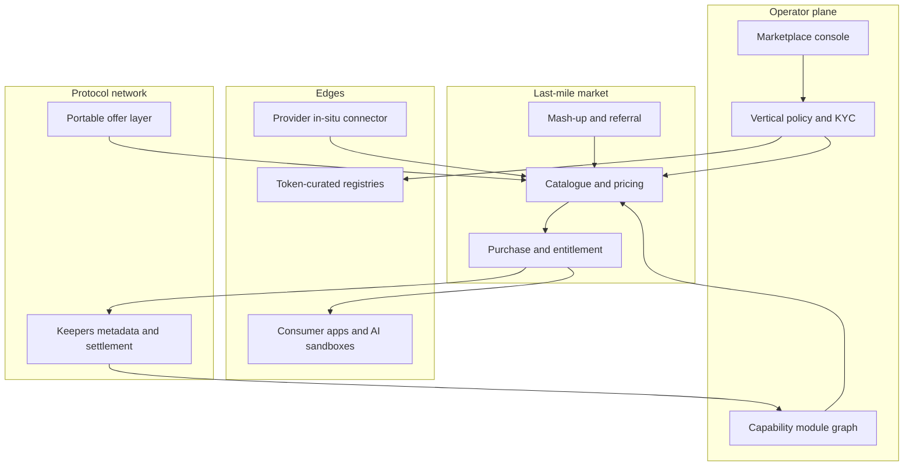

# Quayside

**Source:** `ai-in-decentralized+ai/openminedOcean Protocol Reference Marketplace Framework/`
**Domain:** `ai-decentralized`
**One-liner:** A white-label control plane for vertical ai-data marketplaces that onboard providers in situ, price proprietary and commons assets, and compose modular network capabilities so operators ship a last-mile bazaar without rebuilding the exchange protocol.
**Wedge:** Consortium and government-backed marketplace operators launching regulated verticals (mobility, healthcare, financial services) that need a reference marketplace stack with KYC, provenance, and fiat-friendly settlement on day one.
**Positioning:** Where Tidecove-class exchanges publish portable offers and Veridrop-class kernels police incentives, Quayside is the *marketplace operator product*: open-source-style reference capabilities for exposure, processing, persistence, consumption, integration, and governance — assembled per vertical, then modularised as specialist providers emerge.

## Market research synthesis

### Thesis from source

Ocean’s Reference Marketplace Framework (October 2017) is explicitly complementary to the technical primer: it specifies what a *marketplace sitting on the protocol* must do to unlock data for AI. The macro driver is economic — the UK AI industry review cited in the source claims AI could add roughly USD $814B (£630bn) to the UK economy by 2035 and lift annual GVA growth from 2.5% to 3.9%, conditional on easier sectoral data access via data trusts, machine-readable research data, and text-and-data-mining as a standard research tool. Ocean’s answer is a decentralized exchange protocol with marketplaces as the last mile between rights-holders and consumers.

The framework’s differentiating object is the **Reference Data Marketplace**: open-source code and (as far as possible) open-source legals that would-be marketplaces clone to start quickly, while the Ocean network supplies liquidity, token incentives, user registries, and metadata permanence (IPDB). Core marketplace capabilities are listed as a stack — data exposure/ingestion (raw or warehouse-modelled; in-network commons or behind firewalls), processing (cleanse, transform, mash, deploy AI; on-prem when required), persistence (blob, IPFS/Storj/Swarm-class, MOLAP/ROLAP, in-memory, document, search-indexed), consumption (B2C/B2B/M2M interfaces), integration (APIs/microservices with entitlement), governance (immutable provenance plus curation markets for MDM dictionaries), and utility (token rails and orchestration protocols).

Stakeholders expand beyond buyer/seller: providers (owners and custodians), consumers (AI specialists through governments), marketplaces, mashers (create derivative assets with background-IP tracking), referrers, keepers (penalised for SLA breach), and regulators as first-class participants rather than adversaries. Token-curated registries stake reputation into semantic models and service lists so standards converge without a central standards body. Deployment strategy anticipates an initial monolithic marketplace (DEX + BigchainDB heritage, Singapore-centred Genesis Program) that later dismantles into modular best-of-breed capability providers — with marketplace operators becoming referrers of data *and* component capabilities.

Data types and pricing are operational, not philosophical: proprietary, regulated, and commons; free commons incentives; exchange pricing for fungible controlled data; fixed price, auction, or royalties for unique non-fungible assets. Engagement is sequenced — prime providers first (30+ lined up for Genesis; in-situ exposure via light-touch API and a pushed daemon), then consumers (KYC for FS/healthcare marketplaces; anonymous permissionless elsewhere; sandboxed or encrypted-algorithm compute-to-data for AIs). The Hello World delivery plan is an 18-month Genesis Program of six regulated sprints: mobility/logistics, financial services, healthcare diagnostics & therapy, consumer products & retail, built-up environment, and utilities (energy & water). Product implication: ship a vertical marketplace assembly and ops plane, not another protocol whitepaper.

### Buyer & economic model

- **Primary buyer:** Marketplace GM or consortium programme lead standing up a vertical ai-data bazaar (often with a government or industry sandbox sponsor).
- **Users:** data providers/custodians, data scientists and AI teams, data mashers, marketplace curators/referrers, KYC/compliance officers, keeper/ops partners, regulators/auditors observing provenance.
- **Budget owner / value metric:** marketplace P&L and programme grant. Value metric is time-to-first-vertical listing, GMV across priced + commons assets, and share of listings with complete provenance/entitlement trails.
- **Competing status quo:** bespoke portal per consortium; centralized brokers demanding upload; protocol SDKs without operator UX; bilateral SFTP + NDA deals that never productise into a reusable market.

### Domain constraints

- **Regulatory / trust / safety:** regulated verticals require KYC; provenance must satisfy auditors; regulators are onboarded as stakeholders; TCRs and staking must not become capture vehicles for bad standards.
- **Data sensitivity:** proprietary and regulated data stay in situ behind firewalls; consumption may be download, dashboard, mash-up window, or compute-to-data — never a single forced transfer model.
- **Change-management realities:** operators start monolithic then must swap in modular specialist capabilities without rewriting provider onboarding; fiat UX is required even when network settlement is tokenised.

## Business requirements

- BR-1: A marketplace operator must stand up a vertical catalogue (domain, KYC policy, pricing schemes) without hosting provider raw payloads by default.
- BR-2: Providers must expose assets in situ via a controlled connector/daemon path, with consumption parameters recorded for provenance before any consumer access.
- BR-3: Each listing must declare data class — proprietary, regulated, or commons — and only offer pricing schemes valid for that class (free; exchange; fixed/auction/royalties).
- BR-4: Marketplace take-rate and any fiat↔token conversion spread must be disclosed as explicit line items to buyers and sellers.
- BR-5: Mashers must publish derivative assets with background-IP lineage to source listings so royalties and attribution remain enforceable.
- BR-6: Entitlement checks must gate every consumption path (download, API, dashboard, compute-to-data) using the licence recorded at purchase.
- BR-7: Token-curated registry entries for semantic dictionaries and approved capability providers must be stakable, challengeable, and auditable.
- BR-8: Operators must compose marketplace capabilities (ingest, process, persist, integrate) as swappable modules as specialist network providers emerge.
- BR-9: Regulated verticals must support KYC onboarding gates; permissionless verticals must be explicitly labelled as such.
- BR-10: Keepers and capability providers that miss published SLAs must trigger visible penalties or clawbacks affecting marketplace trust scores.
- BR-11: Period statements must reconcile GMV, commons incentive events, mash-up royalties, and disputes for programme and external audit.
- BR-12: Genesis-style vertical programmes must support sprint-scoped catalogues and regulator observer roles without granting them commercial custody of assets.

## User stories

Canonical user stories live in sibling [USER_STORIES.md](USER_STORIES.md).

## System design

### Overview

Quayside is the operator plane for a vertical data marketplace on a decentralized exchange network. Operators configure domain policy (KYC, pricing templates, module graph). Providers register and expose in-situ assets. Consumers discover, purchase under class-appropriate pricing, and consume via entitled channels. Mashers and referrers add derivative supply and demand generation. Governance (provenance, TCR, SLA penalties) and settlements flow through Quayside while raw payloads remain at provider boundaries unless the licence allows transfer.

### Actors & boundaries

- **Actors:** marketplace operator, data owner, data custodian, consumer, masher, referrer, keeper/capability provider, compliance officer, regulator observer.
- **Trust boundary:** metadata, licences, entitlements, TCR state, and settlement records live in Quayside/network keepers; raw proprietary/regulated payloads stay at the provider unless a transfer licence is exercised.
- **Human-in-the-loop points:** KYC approval, TCR challenges, dispute resolution on failed delivery or royalty splits, module-provider substitution, regulator programme scoping.

### Core capabilities

1. **Vertical marketplace configuration** — domain, KYC mode, pricing templates, take-rate, fiat rails.
2. **In-situ asset exposure** — connector/daemon registration, consumption parameters, provenance write.
3. **Catalogue and pricing** — proprietary/regulated/commons classes; free, exchange, fixed, auction, royalty schemes.
4. **Entitled consumption** — download, API, dashboard, compute-to-data gated by licence.
5. **Mash-up and lineage** — derivative assets with background-IP and royalty hooks.
6. **Capability module graph** — compose ingest/process/persist/integrate providers; swap over time.
7. **Token-curated registries** — stake, rank, challenge semantic dictionaries and approved providers.
8. **Settlement and statements** — GMV, commons events, royalties, disclosed fees, disputes.
9. **Programme / Genesis ops** — sprint catalogues, regulator observer roles, audit exports.

### Conceptual data

- **Primary entities:** Marketplace, VerticalProgramme, Participant, KycCase, AssetListing, ConsumptionPolicy, PriceScheme, Entitlement, MashupAsset, Referral, CapabilityModule, RegistryEntry, StakePosition, Challenge, SettlementStatement, SlaPenalty.
- **Critical events:** marketplace launched, asset exposed, KYC decided, purchase settled, entitlement granted/revoked, mash-up published, module swapped, TCR challenged, SLA penalty applied, programme sprint closed.
- **Retention / audit needs:** provenance and settlement history retained for regulatory and commercial dispute windows; KYC artefacts retained per jurisdiction; personal data in listings minimised to metadata necessary for entitlement.

### Integrations (conceptual)

- **Systems of record:** provider warehouses/object stores, enterprise identity/KYC vendors, billing/ERP for fiat invoices, network keepers for metadata and token settlement.
- **Upstream signals:** curation/relevance signals from the protocol layer, SLA heartbeats from capability providers, regulator programme calendars.
- **Downstream actions:** connector deploy instructions, entitlement tokens to consumption gateways, royalty payouts, module routing changes, audit pack export.

### High-level architecture

### Success metrics

- **Leading:** days from marketplace create to first entitled consumption; % listings with complete provenance + consumption policy; modular capability swap count without provider re-onboarding; KYC median time for regulated verticals.
- **Lagging:** GMV and commons contribution volume per vertical; dispute rate on unreachable assets; royalty accuracy on mash-ups; programme audit findings closed without custody breaches; operator net retention across Genesis-style sprints.

## OpenAPI skeleton

Canonical HTTP surface lives in sibling `openapi.yaml`. Summarize here:

- **Base path:** `/v1/...`
- **Auth:** API key and/or Bearer JWT (operator)
- **Resource groups:** Marketplaces, AssetListings, Entitlements, CapabilityModules, RegistryEntries, Settlements
