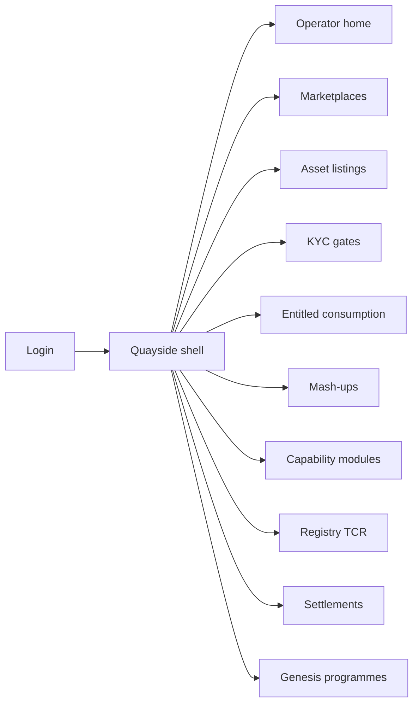
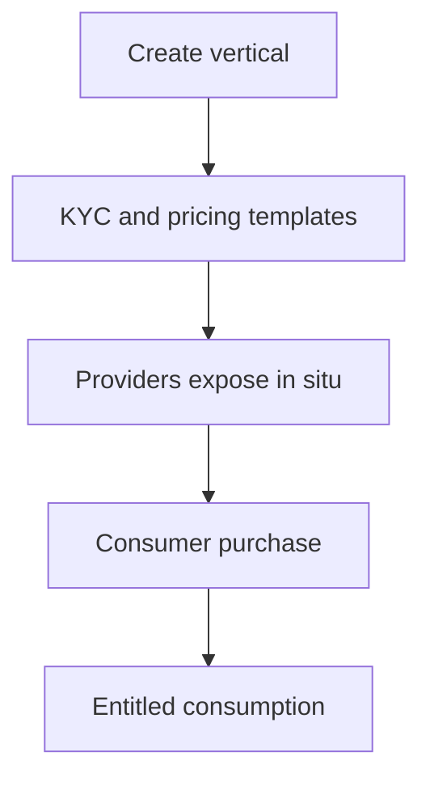

# Quayside — Web app

**Product:** [PRODUCT.md](./PRODUCT.md)
**Primary surface:** Vertical ai-data marketplace operator console (Genesis-style programme ops)
**Secondary surfaces:** Provider in-situ connector status; regulator observer read-only programme dashboard
**Design thesis:** Quayside is the last-mile bazaar control tower — operators assemble a vertical marketplace from modular piers (ingest, process, persist, consume, govern), not a protocol whitepaper viewer and not Tidecove’s publish-once exchange desk. The UI metaphor is a working quay: providers dock in situ; consumers pick up entitled cargo; mashers rebuild crates with lineage tags still attached. Visual language is warm dock-timber and crane-yellow on deep harbour ink: KYC gates feel like customs; TCR challenges feel like contested manifests; module swaps feel like changing a crane without moving the ships. The Quayside wordmark sits as a quiet crane mark on every operator screen so programme sponsors know whose vertical they are launching.

## UX research synthesis

### Category peers (best-in-class)

- **Shopify / BigCommerce admin (operator plane pattern):** Launch a storefront with policies, fees, and apps — without owning inventory logistics. Steal: marketplace create wizard (domain, KYC, pricing templates) then modular apps (BR-1, BR-8); reject generic “SaaS settings” without vertical sprint framing.
- **Palantir Foundry / data marketplace modules (enterprise):** Curated catalogues with entitlement and lineage. Steal: consumption modes gated by licence (BR-6); mash-up lineage (BR-5); reject all-seeing investigator chrome for regulated observers.
- **Stripe Connect / marketplace fee disclosure UIs:** Explicit platform fee lines. Steal: take-rate and fiat↔token spread as line items (BR-4).
- **Singapore-style sandbox programme portals (pattern):** Sprint-scoped catalogues and regulator observers. Steal: Genesis programme roles without custody (BR-12).

### Patterns to adopt / reject

- **Adopt:** Vertical config (KYC, pricing schemes by data class); in-situ connector/daemon exposure; proprietary/regulated/commons classes; entitled consumption paths; mash-up background-IP; capability module graph with hot-swap; TCR stake/challenge; SLA penalties; regulator observer; sprint catalogues.
- **Reject:** Forced provider upload; hiding fees; single consumption model; monolithic forever with no module graph; purple Web3 bazaar; regulator write access to payloads; charging when connector offline.

### Trust, density, and workflow constraints from PRODUCT.md

Operators ship last-mile without hosting raw payloads by default (BR-1). Providers expose in situ with consumption parameters for provenance (BR-2). Pricing schemes must match data class (BR-3). Fees disclosed (BR-4). Every consumption path entitlement-gated (BR-6). Modules swappable without re-onboarding providers (BR-8). Regulated vs permissionless labelled (BR-9). Statements reconcile GMV, commons, royalties, disputes (BR-11).

## Information architecture

### Nav model

### Roles → default home

| Role | Default home | Why |
|------|--------------|-----|
| Marketplace GM / operator | Operator home | Time-to-first listing and GMV |
| Data provider / custodian | Asset listings | In-situ expose (BR-2) |
| AI consumer | Catalogue / consumption | Class and mode filters |
| Data masher | Mash-ups | Lineage and royalties (BR-5) |
| Compliance | KYC gates | Regulated vertical onboarding (BR-9) |
| Regulator observer | Genesis programmes | Read-only sprint oversight (BR-12) |

### Cross-links to OpenAPI resources

| Nav area | OpenAPI tags / resources |
|----------|---------------------------|
| Marketplaces / programmes | Marketplaces |
| Asset listings | AssetListings |
| Entitled consumption | Entitlements |
| Capability modules | CapabilityModules |
| TCR registries | RegistryEntries |
| Settlements | Settlements |

## Screen inventory

### Operator home

- **Purpose:** Answer “is this vertical live, and are modules/KYC healthy?” in one composition.
- **Entry:** Operator login default.
- **Layout regions:** Brand + vertical badge; days-to-first-consumption KPI; listing provenance completeness; module health; KYC queue; SLA penalty strip.
- **Primary actions:** Open catalogue; approve KYC; swap module.
- **Empty / loading / error:** Empty = create marketplace wizard.
- **BR / story ties:** BR-1; operator stories.

### Marketplace create / vertical config

- **Purpose:** Stand up domain, KYC policy, pricing templates, take-rate, fiat rails without hosting payloads.
- **Entry:** Create marketplace CTA.
- **Layout regions:** Domain picker (mobility, FS, health…); KYC mode; pricing scheme matrix by data class; take-rate; permissionless vs regulated label.
- **Primary actions:** Launch; save draft; clone Genesis template.
- **Empty / loading / error:** Invalid scheme for class = block launch.
- **BR / story ties:** BR-1, BR-3, BR-4, BR-9.

### In-situ asset exposure

- **Purpose:** Provider connector/daemon path; record consumption parameters before any access.
- **Entry:** Provider login; Listings → Expose.
- **Layout regions:** Connector status; warehouse/object pointer; consumption parameter form; provenance write confirm.
- **Primary actions:** Deploy connector instructions; publish listing; heartbeat test.
- **Empty / loading / error:** Offline connector = listings non-purchasable (auto-fail checkout).
- **BR / story ties:** BR-2; negative path story.

### Catalogue and class-aware pricing

- **Purpose:** List proprietary/regulated/commons with only valid schemes (free, exchange, fixed, auction, royalties).
- **Entry:** Consumer and curator views.
- **Layout regions:** Class filters; price scheme badges; consumption mode chips; take-rate on detail.
- **Primary actions:** Purchase; bid (auction); filter compute-to-data.
- **Empty / loading / error:** Empty vertical = invite providers.
- **BR / story ties:** BR-3, BR-4.

### Entitled consumption gate

- **Purpose:** Gate download, API, dashboard, compute-to-data by licence at purchase.
- **Entry:** After checkout; Entitlements.
- **Layout regions:** Entitlement list; allowed channels; revoke; mid-checkout parameter-change guard.
- **Primary actions:** Open channel; revoke; re-check connector.
- **Empty / loading / error:** Channel not licensed = hidden; connector offline at checkout = auto-fail charge.
- **BR / story ties:** BR-6.

### Mash-up lineage

- **Purpose:** Publish derivatives with background-IP to sources for royalties/attribution.
- **Entry:** Masher home.
- **Layout regions:** Source picker; lineage graph; royalty split; publish mash-up listing.
- **Primary actions:** Publish; preview royalty; submit attribution.
- **Empty / loading / error:** Missing lineage = cannot publish.
- **BR / story ties:** BR-5.

### Capability module graph

- **Purpose:** Compose ingest/process/persist/integrate; swap specialists without re-onboarding providers.
- **Entry:** Modules nav.
- **Layout regions:** Graph of modules; provider SLA; swap wizard; routing preview.
- **Primary actions:** Swap module; roll back; view SLA.
- **Empty / loading / error:** Swap fail = keep prior module live.
- **BR / story ties:** BR-8, BR-10.

### Token-curated registry

- **Purpose:** Stake, rank, challenge semantic dictionaries and approved capability providers.
- **Entry:** TCR nav; compliance challenge.
- **Layout regions:** Registry entries; stake positions; challenge queue; audit trail.
- **Primary actions:** Stake; challenge; resolve.
- **Empty / loading / error:** Empty registry = seed Genesis dictionaries.
- **BR / story ties:** BR-7.

### KYC onboarding

- **Purpose:** Regulated vertical gates; permissionless verticals explicitly labelled.
- **Entry:** Compliance; consumer first access.
- **Layout regions:** Case queue; decision; artefact retention note; vertical label banner.
- **Primary actions:** Approve/deny; request more info.
- **Empty / loading / error:** Permissionless marketplace hides KYC with clear label.
- **BR / story ties:** BR-9.

### Genesis programme ops

- **Purpose:** Sprint-scoped catalogues and regulator observer roles without commercial custody.
- **Entry:** Programme nav; regulator login.
- **Layout regions:** Sprint timeline (mobility → FS → health…); catalogue scope; observer read dashboards; audit export.
- **Primary actions:** Open sprint; invite observer; close sprint with pack.
- **Empty / loading / error:** Observer sees no payload custody controls — read only.
- **BR / story ties:** BR-12.

### Settlements and royalties

- **Purpose:** Reconcile GMV, commons incentives, mash-up royalties, fees, disputes.
- **Entry:** Finance / operator.
- **Layout regions:** Statement builder; fee and spread lines; royalty ledger; dispute holds.
- **Primary actions:** Generate statement; payout royalties; open dispute.
- **Empty / loading / error:** Unreachable-asset disputes highlighted.
- **BR / story ties:** BR-4, BR-11.

### SLA penalty board

- **Purpose:** Visible penalties/clawbacks for keepers and capability providers missing SLAs.
- **Entry:** Ops; module detail.
- **Layout regions:** Trust scores; penalty events; marketplace impact.
- **Primary actions:** Apply penalty; restore after remediation.
- **Empty / loading / error:** Empty = healthy SLAs message.
- **BR / story ties:** BR-10.

## Key flows

1. **Launch vertical** — create marketplace → KYC/pricing templates → invite providers → first entitled consumption; failure: class/scheme mismatch blocks launch.

2. **In-situ expose → purchase** — connector healthy → listing → checkout → entitlement; offline connector auto-fails charge.

3. **Module swap** — pick specialist → route traffic → providers unchanged → SLA monitored (BR-8).

4. **Mash-up publish** — select sources → lineage → royalty split → list derivative (BR-5).

5. **TCR challenge** — stake challenge on bad dictionary → audit → resolve (BR-7).

## Design system

### Tokens (CSS variables)

- `--color-ink: #F3EEE6` — primary text on dark
- `--color-harbour-950: #0C1014` — app ground
- `--color-harbour-900: #161C22` — panels
- `--color-timber: #B8A48A` — secondary labels
- `--color-crane: #E0B44A` — operator accent (crane-yellow)
- `--color-dock: #4A9B8C` — entitled / healthy connector
- `--color-amber: #E0A12B` — KYC pending / challenge
- `--color-coral: #E85D4C` — SLA penalty / checkout fail
- `--color-brand: #E8C878` — Quayside wordmark
- `--font-display: "Recoleta", "Fraunces", serif` — vertical titles
- `--font-body: "Work Sans", sans-serif`
- `--font-mono: "IBM Plex Mono", monospace` — listing ids, TCR stakes
- `--space-1`…`--space-8`: 4px scale
- `--radius-sm: 4px`; `--radius-md: 8px`
- `--motion-dock: 200ms ease-out` — listing moors into catalogue
- `--motion-swap: 280ms ease-in-out` — module graph rewire
- Atmosphere: timber grain in panel headers; soft crane-boom diagonal highlight; dockside dusk — not purple neon bazaar.

### Typography & brand

- Recoleta/Fraunces for vertical and programme names; mono for listings and stakes.
- Brand crane mark left of chrome on operator and settlement screens.
- Login: brand hero, one headline (“Assemble the vertical bazaar — providers stay docked in situ”), one CTA.

### Do / don’t

- **Do:** Class-aware pricing; disclose fees; entitlement on every channel; module graph; regulator read-only; fail closed on offline connectors.
- **Don’t:** Purple Web3 glow; forced uploads; hidden spreads; editable provenance; observer write to assets.

### Accessibility & domain trust cues

- AA+ crane/dock/coral on harbour; KYC and penalty never colour-only.
- Live regions for connector down and SLA penalties.
- Focus order: marketplace → expose → catalogue → entitlement → statement.
- Programme audit packs machine-readable.

## Component patterns

- **VerticalLaunchWizard** — domain, KYC, schemes, take-rate.
- **InSituConnectorStatus** — heartbeat + offline purchase block.
- **DataClassPriceMatrix** — valid schemes per class.
- **EntitlementChannelGate** — download/API/dashboard/C2D.
- **MashupLineageGraph** — background-IP edges.
- **CapabilityModuleGraph** — swappable piers.
- **TcrChallengeRow** — stake and challenge.
- **GenesisSprintTimeline** — programme scopes.
- **FeeSpreadLine** — take-rate + conversion disclosure.
- **RegulatorObserverBanner** — read-only custody-free.

## Out of scope for v1 web

- Tidecove protocol exchange replacement; Veridrop reward kernel; full warehouse ETL IDE; consumer mobile bazaar app; on-chain wallet as primary checkout for enterprises; bespoke legal drafting tool beyond open-legal templates.
